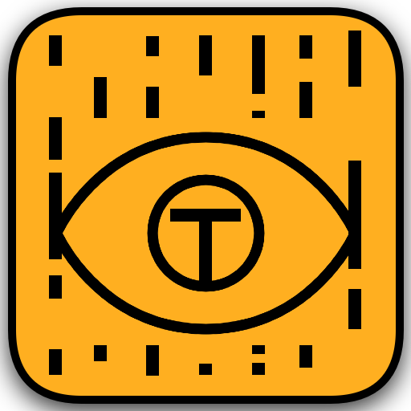

# Teleye

A clean, minimal teleprompter for desktop. Built with Electron.



## Features

- **Click-through overlay** — sits on top of your screen, you can still interact with apps behind it
- **Global shortcuts** — control playback without switching windows
- **Adjustable scroll speed** — dial it in from the dashboard
- **Auto-updates** — gets new versions automatically via GitHub Releases

## Download

Grab the latest installer from [Releases](https://github.com/TheJonathanC/teleye/releases).

## Shortcuts

| Action | Shortcut |
|---|---|
| Play / Pause | `Ctrl + Space` |
| Toggle Interaction Mode | `Ctrl + Shift + L` |
| Exit Teleprompter | `Ctrl + Alt + X` |

**Interaction Mode** — when ON, you can click and edit inside the teleprompter window. When OFF (default), the window is fully click-through.

## Usage

1. Paste your script into the editor
2. Set your scroll speed
3. Click **Start Prompter**
4. Press `Ctrl + Space` to play

## Development

```bash
npm install
npm start
```

## Building

```bash
# Local installer
npm run dist:win
```

## License

MIT
